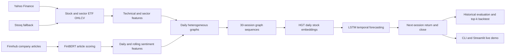
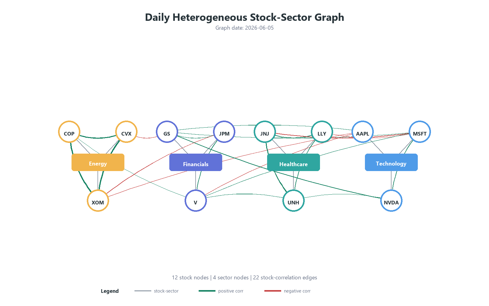

## Stock Return Prediction with Sentiment-Aware Heterogeneous GNNs

An end-to-end research project for predicting **next-trading-session stock returns** by combining market data, financial-news sentiment, sector context, graph neural networks, and temporal sequence modeling.

The system represents each trading session as a heterogeneous graph containing stock and sector nodes. A Heterogeneous Graph Transformer (HGT) learns cross-sectional relationships for each session, while an LSTM models how each stock's graph embedding evolves over a rolling 30-session sequence. FinBERT-derived sentiment features complement conventional OHLCV technical indicators.

> **Research disclaimer:** This repository is an academic prototype, not financial advice or a production trading system. Historical results do not guarantee future performance.

## Highlights

- End-to-end workflows for crawling, preprocessing, graph construction, training, historical inference, backtesting, and live prediction.
- A fixed universe of 12 large-cap U.S. stocks across four sectors.
- FinBERT article scoring with daily and rolling sentiment aggregation.
- Daily PyTorch Geometric heterogeneous graphs with stock-sector membership and rolling stock-correlation edges.
- HGT + LSTM forecasting of next-session returns and implied closing prices.
- Equal-weight top-k long-only backtesting with turnover-based transaction costs.
- CLI and Streamlit interfaces for live prediction.
- A tested implementation with 62 passing unit tests in the current repository state.

## System Workflow



## Stock Universe

The ticker and sector mappings are defined in `src/data_pipeline/crawl_config.py`.

| Sector | Sector ETF | Stocks |
|---|---|---|
| Technology | XLK | AAPL, MSFT, NVDA |
| Healthcare | XLV | JNJ, LLY, UNH |
| Financials | XLF | GS, JPM, V |
| Energy | XLE | COP, CVX, XOM |

## Data Sources

| Data | Primary source | Fallback / optional source | Default output |
|---|---|---|---|
| Stock OHLCV | Yahoo Finance | Stooq | `data/raw/price_data.csv` |
| Company articles | Finnhub Company News API | None | `data/raw/article_data.csv` |
| Sector ETF OHLCV | Yahoo Finance | Stooq | Used to build `data/processed/sector_feature_data.csv` |
| Sector valuation | Optional `fundamental_data.csv` | Missing values are allowed | `sector_pe_median` |
| Sector sentiment | Optional `sector_news_data.csv` | Missing values are allowed | `sector_sentiment` intermediate column |

Finnhub access requires an API key. Stock and ETF price crawling can run without it.

## Feature Engineering

### Stock-node features

Each stock node contains 19 model inputs:

| Category | Features |
|---|---|
| Returns | `return_1d`, `return_5d`, `return_20d` |
| Price normalization | `close_norm_20d` |
| Momentum | `rsi_14_norm`, `macd_diff_norm` |
| Volatility and range | `bb_pband`, `atr_norm` |
| Volume | `volume_ratio_20d` |
| Daily sentiment | `sentiment_score`, `news_count`, `positive_count`, `negative_count`, `neutral_count` |
| Rolling sentiment | `sentiment_score_3d`, `news_count_3d`, `positive_count_3d`, `negative_count_3d`, `neutral_count_3d` |

Technical features use only the current and previous observations for a ticker. Early rolling-window values may be missing in the processed CSV and are filled with zero when graphs are built with the default training configuration.

### Sentiment features

For each article, `ProsusAI/finbert` produces positive, negative, and neutral probabilities. The article sentiment score is:

```text
sentiment_score = P(positive) - P(negative)
```

Article scores are aggregated by date and ticker, then aligned to all stock trading dates. Three-session rolling means or sums are created using the current and preceding sessions. Dates without articles receive zero-valued sentiment features.

### Sector-node features

Each sector node contains seven model inputs derived primarily from its ETF:

- `etf_return_1d`
- `etf_return_5d`
- `etf_rsi`
- `etf_macd_diff`
- `etf_volatility`
- `fund_flow_norm`
- `sector_pe_median`

The optional `sector_sentiment` column can be produced by the sector crawler, but it is not currently included in the graph model's sector feature list.

### Prediction target

For a stock observed on session `t`, the label is the return to its next available trading session:

```text
target_return(t) = close(t + 1 trading session) / close(t) - 1
```

The model predicts this return directly. Its implied closing-price prediction is:

```text
pred_close = last_close * (1 + pred_return)
```

## Heterogeneous Graph Representation

One `HeteroData` graph is built for every common stock/sector trading date.

### Node types

- `stock`: one node per configured ticker, ordered consistently across all dates.
- `industry`: one node per configured sector, also ordered consistently.

### Edge types

| Edge type | Meaning |
|---|---|
| `stock -> belongs_to -> industry` | Connects each stock to its sector |
| `industry -> has_stock -> stock` | Reverse sector-membership relation |
| `stock -> corr -> stock` | Bidirectional rolling Pearson-correlation relation |

Correlation edges use a 20-session window by default, require at least 10 observations, and retain the top three neighbors by absolute correlation for each stock. Edge attributes contain both signed correlation and absolute correlation. The current HGT encoder consumes the edge topology but does **not** pass these edge attributes into `HGTConv`.



## Model Architecture

The default training configuration is defined by `HgtLstmTrainingConfig` in `src/training/trainer.py`.

1. **Daily HGT encoder**
   - Projects stock and industry features to a shared hidden space.
   - Applies two HGT layers with two attention heads.
   - Produces one 64-dimensional embedding per stock per session.

2. **Temporal LSTM**
   - Receives a 30-session embedding sequence for each stock.
   - Uses the final LSTM state to predict next-session return.

3. **Optimization**
   - Mean squared error on stock returns.
   - AdamW with a default learning rate of `1e-3` and weight decay of `1e-4`.
   - Gradient clipping at norm `1.0`.
   - Chronological 80/20 sequence split without shuffling.
   - The best checkpoint is selected by evaluation-split return MSE.

## Repository Structure

```text
.
|-- apps/
|   `-- streamlit_live_demo.py       # Interactive live prediction UI
|-- checkpoints/
|   `-- hgt_lstm_stock_predictor.pt  # Current trained checkpoint
|-- configs/                         # Reserved YAML configuration placeholders
|-- data/
|   |-- raw/                         # Crawled price and article data
|   |-- processed/                   # Features, predictions, and backtests
|   `-- live/                        # Generated live-run artifacts (gitignored)
|-- pipelines/
|   |-- crawl_data.py                # Crawl orchestration
|   |-- run_pipeline.py              # Offline feature pipeline
|   |-- build_graphs_demo.py         # Graph-construction demonstration
|   |-- visualize_daily_graph.py     # SVG/PNG graph export
|   |-- train_hgt_lstm.py            # Training CLI
|   |-- infer.py                     # Historical inference and backtesting
|   `-- live_predict.py              # Live crawl and prediction CLI
|-- reports/figures/                 # Exported graph visualizations
|-- src/
|   |-- data_pipeline/               # Crawlers and OHLCV preprocessing
|   |-- evaluation/                  # Metrics and top-k backtest
|   |-- features/                    # FinBERT extraction and graph builder
|   |-- models/                      # HGT, LSTM, and fused predictor
|   `-- training/                    # Training configuration and loop
|-- tests/                           # Unit tests
|-- requirements.txt
`-- README.md
```

The YAML files under `configs/` are currently empty placeholders. Runtime defaults come from Python constants, `HgtLstmTrainingConfig`, checkpoint metadata, and CLI arguments.

## Installation

Run all commands from the repository root.

### 1. Create a virtual environment

PowerShell:

```powershell
python -m venv .venv
.\.venv\Scripts\Activate.ps1
```

Bash:

```bash
python -m venv .venv
source .venv/bin/activate
```

### 2. Install dependencies

```bash
python -m pip install --upgrade pip
python -m pip install -r requirements.txt
```

The main dependencies are PyTorch, PyTorch Geometric, Transformers, pandas, yfinance, and Streamlit. GPU execution additionally requires a PyTorch build compatible with the installed CUDA runtime.

### 3. Configure Finnhub when article sentiment is needed

PowerShell:

```powershell
$env:FINNHUB_API_KEY = "your-finnhub-api-key"
```

Bash:

```bash
export FINNHUB_API_KEY="your-finnhub-api-key"
```

Do not commit API keys. `.env` files are ignored by Git, although the project does not automatically load them.

## Usage

### 1. Crawl data

Crawl all configured sources using the default date range:

```bash
python pipelines/crawl_data.py --all
```

Because `--all` includes Finnhub articles, `FINNHUB_API_KEY` must be set. Individual components can be run separately:

```bash
python pipelines/crawl_data.py --price
python pipelines/crawl_data.py --article
python pipelines/crawl_data.py --sector-features
```

Custom historical range and sector anchor date:

```bash
python pipelines/crawl_data.py --all \
  --start-date 2023-01-01 \
  --end-date 2026-01-01 \
  --anchor-date 2025-12-31
```

On PowerShell, place the command on one line or replace Bash line-continuation characters with PowerShell backticks.

### 2. Build stock and sentiment features

```bash
python pipelines/run_pipeline.py --device auto
```

This creates or reuses:

- `data/processed/price_features.csv`
- `data/processed/article_finbert_scores.csv`
- `data/processed/daily_sentiment_features.csv`
- `data/processed/stock_node_features.csv`

To rebuild the OHLCV feature file:

```bash
python pipelines/run_pipeline.py --device auto --rebuild-price-features
```

FinBERT scoring can be expensive. If the configured scored-news output already exists, it is treated as a cache without checking whether the article input changed. Use a new cache path when processing newly crawled articles:

```bash
python pipelines/run_pipeline.py \
  --device auto \
  --scored-news-output data/processed/article_finbert_scores_fresh.csv
```

### 3. Inspect or visualize graphs

Print graph shapes and sequence counts:

```bash
python pipelines/build_graphs_demo.py
```

Export SVG and PNG files for the latest available graph:

```bash
python pipelines/visualize_daily_graph.py
```

Export a specific graph date:

```bash
python pipelines/visualize_daily_graph.py --date 2026-06-05
```

### 4. Train the HGT + LSTM model

Use automatic device selection:

```bash
python pipelines/train_hgt_lstm.py --device auto
```

Explicit CPU or CUDA runs:

```bash
python pipelines/train_hgt_lstm.py --device cpu --epochs 20
python pipelines/train_hgt_lstm.py --device cuda --epochs 20
```

Useful overrides include `--sequence-length`, `--train-ratio`, `--max-days`, `--learning-rate`, `--end-date`, and `--checkpoint`.

### 5. Run historical inference and backtesting

Rebuild the checkpoint's chronological test split, export predictions, and run a top-three strategy:

```bash
python pipelines/infer.py --device auto --k 3 --fee-rate 0.001
```

Default outputs:

- `data/processed/test_predictions.csv`
- `data/processed/backtest_top3_long_only.csv`

Generate predictions without a backtest:

```bash
python pipelines/infer.py --device auto --no-backtest
```

For each signal date, the backtest ranks finite predictions, equally weights the top `k`, and realizes their actual next-session returns. Transaction cost is `turnover * fee_rate`.

### 6. Run live prediction from the CLI

```bash
python pipelines/live_predict.py \
  --device auto \
  --fetch-calendar-days 90 \
  --min-sessions 30 \
  --top-k 3
```

The live pipeline:

1. Loads the trained checkpoint and its configuration.
2. Crawls recent stock and sector ETF data, retrying with a larger window if necessary.
3. Runs live FinBERT sentiment when a Finnhub key is available.
4. Falls back to zero sentiment if the key is absent or live sentiment processing fails.
5. Builds one graph sequence and ranks all configured stocks by predicted return.

Generated live files are written under `data/live/` and are ignored by Git.

### 7. Run the Streamlit demo

```bash
streamlit run apps/streamlit_live_demo.py
```

The UI accepts a checkpoint path, optional Finnhub key, device, and top-k value. It displays ranked return and closing-price forecasts and allows the prediction table to be downloaded as CSV.

## Tests

The repository root must be available on `PYTHONPATH` for test imports in the current project layout.

PowerShell:

```powershell
$env:PYTHONPATH = (Get-Location).Path
python -m pytest -q
```

Bash:

```bash
PYTHONPATH=. python -m pytest -q
```

Current expected result:

```text
62 passed
```

One known warning may be emitted when PyTorch wraps a non-writable NumPy array during graph construction.

## Current Repository Artifacts

The following figures describe the committed data and checkpoint at the time this README was written. They are snapshots, not guaranteed results for newly crawled data or retrained models.

### Data snapshot

| Artifact | Rows | Coverage |
|---|---:|---|
| Raw stock prices | 8,232 | 12 tickers, 2023-09-12 to 2026-06-05 |
| Raw articles | 55,576 | 12 tickers, 2020-06-13 to 2026-06-09 |
| Sector features | 2,400 | 4 sectors, 2024-01-17 to 2026-06-08 |
| Final stock-node features | 8,232 | 12 tickers, 29 columns including label |

### Checkpoint snapshot

| Property | Value |
|---|---:|
| Daily graphs | 599 |
| Valid 30-session sequences | 569 |
| Training sequences | 455 |
| Evaluation sequences | 114 |
| Best saved epoch | 4 |
| Return MSE | 0.0003796 |
| Return MAE | 0.0138985 |
| Close RMSE | 10.2225 |
| Close MAE | 5.4010 |

The committed top-three, zero-fee backtest covers 114 signal dates from 2025-12-19 through 2026-06-04 and ends at approximately **+24.18% cumulative return**. This number is subject to the evaluation limitations below and should not be interpreted as an unbiased estimate of deployable performance.

## Limitations and Research Considerations

- **No independent validation/test separation:** the chronological evaluation split is used both to select the best checkpoint and to report historical performance. A production-quality study should introduce separate validation and untouched test periods or use walk-forward evaluation.
- **Correlation edge attributes are unused:** signed and absolute correlations are stored on graph edges, but the current HGT forward pass uses only `edge_index_dict`.
- **Missing sector valuation data:** the committed sector dataset contains many missing `sector_pe_median` values. Default graph construction replaces missing numeric features with zero.
- **Simple missing-value treatment:** early technical-window values and absent daily observations are zero-filled at graph construction time, without explicit missingness indicators.
- **FinBERT cache invalidation:** the offline pipeline trusts an existing scored-news cache solely based on its path and does not verify input content or model version.
- **Live sentiment fallback:** live prediction silently remains operational with all-zero sentiment when Finnhub is unavailable, but this changes the input distribution relative to sentiment-enabled training.
- **Sector sentiment is not modeled:** the optional sector sentiment field is collected but excluded from the current industry-node input columns.
- **Limited universe:** conclusions are based on 12 large-cap U.S. stocks and four sectors, limiting generalizability.
- **No configured random seed:** repeated training runs may not be exactly reproducible.
- **Backtest simplifications:** the strategy assumes equal-weight next-session execution and does not model bid-ask spreads, slippage, liquidity limits, taxes, market impact, or shorting.
- **Not investment advice:** forecasts and backtests are experimental outputs and must not be treated as recommendations to buy or sell securities.

## Main Entry Points

| Task | Entry point |
|---|---|
| Crawl source data | `pipelines/crawl_data.py` |
| Build model features | `pipelines/run_pipeline.py` |
| Build sample graph sequences | `pipelines/build_graphs_demo.py` |
| Visualize a graph | `pipelines/visualize_daily_graph.py` |
| Train | `pipelines/train_hgt_lstm.py` |
| Historical inference/backtest | `pipelines/infer.py` |
| Live CLI prediction | `pipelines/live_predict.py` |
| Live web UI | `apps/streamlit_live_demo.py` |## Contributors

- **quangminh01112006** — Data Engineer: multi-source data pipeline (Alpha Vantage, yfinance, Finnhub), sector-news crawling with API key rotation and checkpoint/resume logic.
